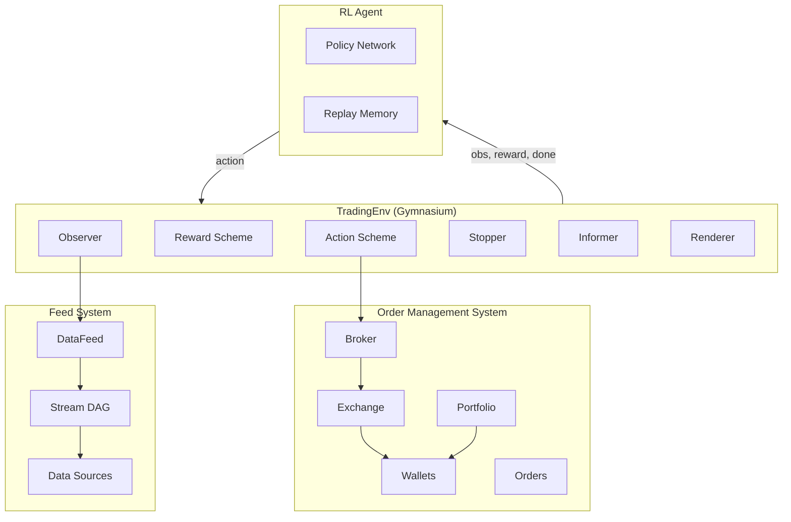

# TensorTrade

**Version**: See `src/tensortrade/version.py`
**Language**: Python 3.12+
**License**: Apache 2.0

## Overview

TensorTrade is a reinforcement learning framework for building, training, and deploying trading agents. It provides a modular, composable architecture built on OpenAI Gymnasium that treats every aspect of a trading environment -- actions, observations, rewards, and order execution -- as pluggable components.

The framework bridges two worlds: quantitative finance (order management, portfolio tracking, exchange simulation) and machine learning (RL environments, agent training, reward engineering). Data flows through a reactive stream-based feed system, and all components share a unified clock for time synchronization.

## Key Features

| Category | Capabilities |
|----------|-------------|
| **Environment** | Gymnasium-compatible `TradingEnv`, component-based design, GPU-aware observations |
| **Action Schemes** | BSH (Buy/Sell/Hold), SimpleOrders, ManagedRiskOrders with stop-loss/take-profit |
| **Reward Schemes** | SimpleProfit, RiskAdjustedReturns (Sharpe/Sortino), PBR, AdvancedPBR |
| **Feed System** | DAG-based reactive data streams, typed operations (float, boolean, string), windowing |
| **Order Management** | Full OMS with Broker, Order lifecycle, Wallet fund locking, Ledger audit trail |
| **Agents** | DQN, A2C, Parallel DQN (deprecated in favor of external RL libraries like Ray RLlib) |
| **Stochastic Processes** | GBM, Heston, Merton, Cox, Ornstein-Uhlenbeck, Fractional Brownian Motion |
| **Execution Services** | Simulated, CCXT, Interactive Brokers, Robinhood |

## Architecture at a Glance



## Quick Start

This example creates a trading environment with inline price data, runs a random agent, and prints the reward at each step. No API keys or data downloads required.

```python
import numpy as np
import tensortrade.env.default as default
from tensortrade.feed.core import DataFeed, Stream
from tensortrade.oms.exchanges import Exchange
from tensortrade.oms.services.execution.simulated import execute_order
from tensortrade.oms.instruments import USD, BTC
from tensortrade.oms.wallets import Wallet, Portfolio

# Generate synthetic price data (random walk starting at 10000)
np.random.seed(42)
price_data = 10000 + np.cumsum(np.random.randn(200) * 50).tolist()
volume_data = (np.random.rand(200) * 100 + 50).tolist()

# Create exchange with simulated execution and a price stream
exchange = Exchange("sim", service=execute_order)(
    Stream.source(price_data, dtype="float").rename("USD-BTC")
)

# Set up portfolio: $10,000 cash, 0 BTC
portfolio = Portfolio(USD, [
    Wallet(exchange, 10000 * USD),
    Wallet(exchange, 0 * BTC),
])

# Create observation feed for the agent
feed = DataFeed([
    Stream.source(price_data, dtype="float").rename("price"),
    Stream.source(volume_data, dtype="float").rename("volume"),
])

# Build a Gymnasium-compatible trading environment
env = default.create(
    portfolio=portfolio,
    action_scheme="bsh",        # Buy / Sell / Hold
    reward_scheme="simple",     # Reward = change in net worth
    feed=feed,
    window_size=10,
)

# Run a random agent for 50 steps and print rewards
obs, info = env.reset()
total_reward = 0.0
for step in range(50):
    action = env.action_space.sample()
    obs, reward, terminated, truncated, info = env.step(action)
    total_reward += reward
    if step % 10 == 0:
        print(f"Step {step:3d} | Action: {action} | Reward: {reward:+.4f} | Net Worth: {portfolio.net_worth:.2f}")
    if terminated or truncated:
        obs, info = env.reset()

print(f"\nTotal reward over 50 steps: {total_reward:+.4f}")
print(f"Final net worth: {portfolio.net_worth:.2f}")
```

## Project Structure

```
src/tensortrade/
    core/               # Base classes: Identifiable, TimeIndexed, Component, Clock, Context
    env/
        generic/        # Abstract TradingEnv and component interfaces
        default/        # Concrete implementations (actions, rewards, observers, renderers)
    feed/
        core/           # Stream, DataFeed, NameSpace, DAG operations
        api/            # Typed stream operations (float, boolean, string, generic)
    oms/
        exchanges/      # Exchange abstraction with price streams
        instruments/    # Instrument, Quantity, TradingPair, ExchangePair
        orders/         # Order, Broker, OrderSpec, Trade, criteria
        wallets/        # Wallet, Portfolio, Ledger
        services/       # Execution (simulated, ccxt, IB) and slippage models
    agents/             # DQN, A2C, Parallel DQN (deprecated)
    stochastic/         # Price process generators (GBM, Heston, etc.)
    data/               # Data loading utilities
```

## Building Sphinx Documentation

Dependencies must be installed using `make sync` from the project root.
Run `make docs-build` from project root, or `make html` from the `docs/` subfolder.

## Documentation

- [Architecture](architecture.md) — System design and components
- [Workflow](workflow.md) — Event flows and processing pipelines
- [State Management](state-management.md) — State lifecycle and data models
- [Development](development.md) — Development guide and best practices

## Links

- GitHub: https://github.com/tensortrade-org/tensortrade
- Documentation: https://www.tensortrade.org/en/latest/
