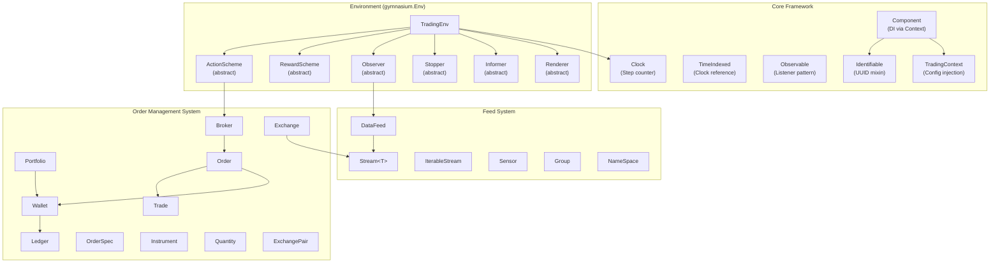
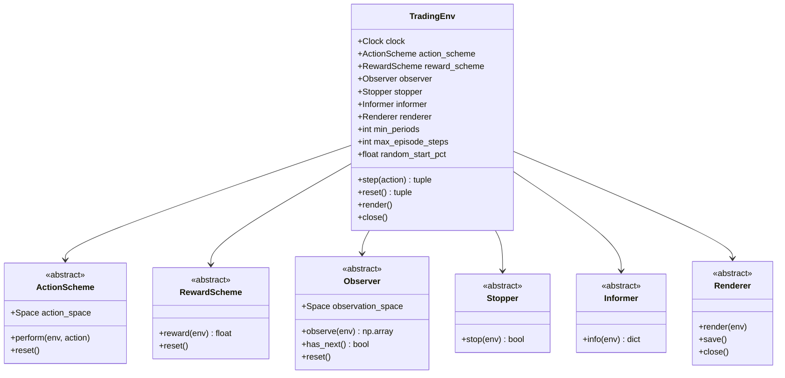
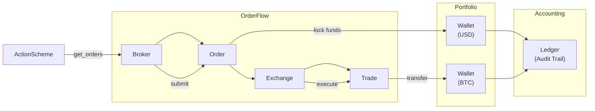
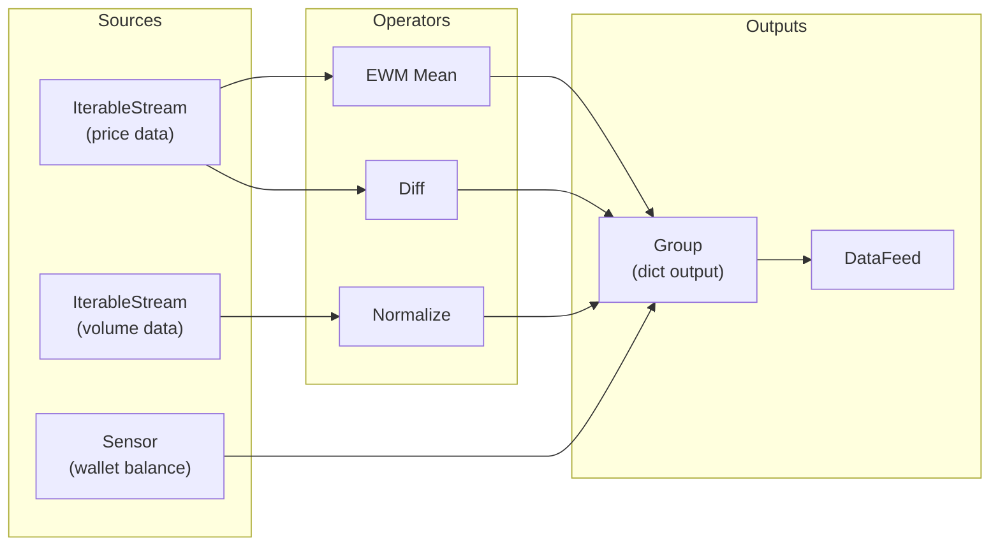

# TensorTrade -- Architecture

## System Architecture

TensorTrade is organized around three major subsystems: the **Environment** (Gymnasium-compatible RL environment), the **Order Management System** (OMS), and the **Feed System** (reactive data streaming). These are connected through a component-based architecture with dependency injection via `TradingContext`.



## Trading Paradigm & Key Features

| Feature | Support | Details |
|---------|---------|---------|
| Backtesting Approach | Event-driven | Gymnasium-compatible step-based simulation with pluggable components |
| Live Trading | Yes | Via CCXT, Interactive Brokers, and Robinhood execution services |
| Paper Trading | Yes | Simulated execution service for paper trading |
| Multi-Asset | Yes | Any asset class via configurable Instrument and ExchangePair abstractions |
| Data Feeds | Reactive stream DAG | Custom data sources via IterableStream, Sensor, or PushFeed (for live data) |
| ML Integration | Yes | Core design -- Gymnasium RL environment for use with Stable Baselines3, Ray RLlib, etc. |
| Risk Management | Built-in | ManagedRiskOrders with stop-loss/take-profit; MaxLossStopper for episode termination |
| Optimization | No | No built-in hyperparameter optimization; relies on external RL training loops |
| Execution | Both | Simulated (in-memory matching), CCXT (live crypto), Interactive Brokers, Robinhood |

## Core Framework

### Base Classes (`src/tensortrade/core/`)

| Class | Purpose |
|-------|---------|
| `Identifiable` | Mixin providing UUID-based `id` property |
| `TimeIndexed` | Mixin providing `clock` property linked to a global or local clock |
| `TimedIdentifiable` | Combines both; tracks `created_at` timestamp |
| `Observable` | Listener pattern with `attach()`/`detach()` |
| `Component` | ABC with `InitContextMeta` metaclass for dependency injection |
| `Clock` | Simple step counter with `increment()` and `reset()` |

### Component System

The `Component` class uses a metaclass (`InitContextMeta`) that intercepts `__init__` to inject configuration from a `TradingContext`. Components are registered in a global registry and receive their config automatically:

```python
with TradingContext(config):
    # All Component subclasses created here receive config
    exchange = Exchange("binance", service=execute_order)
    # exchange.context contains config["exchanges"] merged with shared config
```

### TradingContext

Thread-local context stack (inspired by PyMC3). Supports JSON and YAML configuration files:

```python
context = TradingContext.from_json("config.json")
with context:
    # Components created here use this context
    pass
```

## Environment Layer

### TradingEnv (`src/tensortrade/env/generic/environment.py`)

Extends `gymnasium.Env` and `TimeIndexed`. Composed of six pluggable components:



The `step()` method follows Gymnasium's 5-tuple return: `(observation, reward, terminated, truncated, info)`.

### Default Implementations (`src/tensortrade/env/default/`)

**Action Schemes**:
- `BSH` -- Binary Buy/Sell/Hold with full-portfolio proportion orders
- `SimpleOrders` -- Discrete action space from combinations of criteria, sizes, durations, and sides
- `ManagedRiskOrders` -- Adds stop-loss and take-profit parameters to each order

**Reward Schemes**:
- `SimpleProfit` -- Incremental net worth change over a sliding window
- `RiskAdjustedReturns` -- Sharpe or Sortino ratio over a window
- `PBR` (Position-Based Returns) -- `(price_t - price_{t-1}) * position`
- `AdvancedPBR` -- PBR with trading penalties and hold bonuses

**Observers**:
- `TensorTradeObserver` -- Combines internal streams (wallet balances, net worth) with external data feed into observation windows
- `IntradayObserver` -- Episode-based observer that stops at a configurable intraday time

**Stoppers**:
- `MaxLossStopper` -- Stops episode when portfolio loss exceeds threshold

## Order Management System

### Architecture



### Key OMS Components

**Exchange** (`src/tensortrade/oms/exchanges/exchange.py`):
- Holds price streams and exchange options (commission, min/max trade size)
- Executes orders by calling a configurable `service` function
- Provides `quote_price()` for current market prices

**Portfolio** (`src/tensortrade/oms/wallets/portfolio.py`):
- Collection of `Wallet` instances across exchanges
- Tracks net worth, performance, and profit/loss
- Listens to observer feed data for performance updates

**Wallet** (`src/tensortrade/oms/wallets/wallet.py`):
- Holds balance of a specific instrument on a specific exchange
- Supports `lock()`, `unlock()`, `deposit()`, `withdraw()` operations
- Fund locking ensures order integrity (no double-spending)
- Static `transfer()` method handles cross-wallet transfers with conservation checks

**Broker** (`src/tensortrade/oms/orders/broker.py`):
- Maintains unexecuted and executed order queues
- `update()` checks order executability and expiration each step
- Implements `OrderListener` to handle fill/complete events and chain follow-up orders

**Order** (`src/tensortrade/oms/orders/order.py`):
- Full lifecycle: PENDING -> OPEN -> PARTIALLY_FILLED -> FILLED (or CANCELLED)
- Supports criteria-based execution (conditional orders)
- `OrderSpec` enables chaining (e.g., stop-loss after entry fill)
- Locks wallet funds on creation; releases on completion/cancellation

**Instruments** (`src/tensortrade/oms/instruments/`):
- `Instrument` -- Named asset with precision (e.g., `USD = Instrument("USD", 2)`)
- `Quantity` -- Amount of an instrument with path tracking and quantization
- `TradingPair` -- Base/quote instrument pair (e.g., `BTC/USD`)
- `ExchangePair` -- Trading pair bound to a specific exchange

### Execution Services

| Service | Location | Purpose |
|---------|----------|---------|
| `simulated` | `src/tensortrade/oms/services/execution/simulated.py` | In-memory order matching for backtesting |
| `ccxt` | `src/tensortrade/oms/services/execution/ccxt.py` | Live trading via CCXT library |
| `interactive_brokers` | `src/tensortrade/oms/services/execution/interactive_brokers.py` | IB TWS/Gateway integration |
| `robinhood` | `src/tensortrade/oms/services/execution/robinhood.py` | Robinhood API integration |

### Slippage Models

- `RandomSlippageModel` -- Adds random slippage within configurable bounds

## Feed System

### Stream DAG

The feed system is a **reactive, DAG-based data pipeline**. Data flows from sources through transformation operators to consumers.



### Key Feed Components

**Stream[T]** (`src/tensortrade/feed/core/base.py`):
- Generic base class for all data streams
- Factory methods: `source()`, `sensor()`, `group()`, `constant()`, `placeholder()`
- DAG operations: `gather()` (collect edges), `toposort()` (execution order)
- Mixin system for type-specific operations (float, boolean, string)

**DataFeed** (`src/tensortrade/feed/core/feed.py`):
- Compiles streams into topologically-sorted execution order
- `next()` runs all streams and returns dict of values
- `has_next()` checks if all source streams have data remaining

**PushFeed**: Online variant where data is pushed via `Placeholder` streams (for live trading).

### Stream Type System

Registered via decorators:
- **Float operations**: `add`, `sub`, `mul`, `div`, `log`, `pct_change`, `diff`, `fillna`, etc.
- **Window operations**: `rolling(window).mean()`, `ewm(span).mean()`, `expanding().sum()`
- **Boolean operations**: `and_`, `or_`, `not_`, `xor`
- **String operations**: Various string transformations

## Stochastic Processes

For synthetic data generation and testing:

| Process | Module | Description |
|---------|--------|-------------|
| GBM | `src/tensortrade/stochastic/processes/gbm.py` | Geometric Brownian Motion |
| Heston | `src/tensortrade/stochastic/processes/heston.py` | Stochastic volatility model |
| Merton | `src/tensortrade/stochastic/processes/merton.py` | Jump diffusion |
| Cox | `src/tensortrade/stochastic/processes/cox.py` | Cox-Ingersoll-Ross process |
| OU | `src/tensortrade/stochastic/processes/ornstein_uhlenbeck.py` | Mean-reverting process |
| FBM | `src/tensortrade/stochastic/processes/fbm.py` | Fractional Brownian Motion |

## Agent System (Deprecated)

Built-in agents (`src/tensortrade/agents/`) are deprecated in favor of external RL libraries:

- `DQNAgent` -- Deep Q-Network with TensorFlow
- `A2CAgent` -- Advantage Actor-Critic
- `ParallelDQNAgent` -- Multi-process DQN training

The recommended approach is to use Ray RLlib, Stable Baselines3, or any Gymnasium-compatible library with `TradingEnv`.

---
## See Also
- [README](README.md) — Project overview and quick start
- [Workflow](workflow.md) — Event flows and processing pipelines
- [State Management](state-management.md) — State lifecycle and data models
- [Development](development.md) — Development guide and best practices
