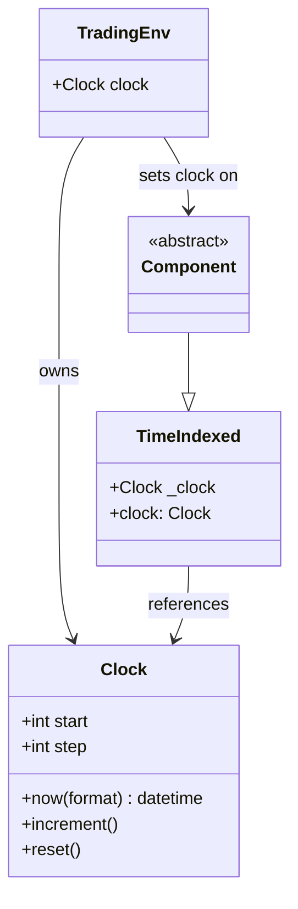
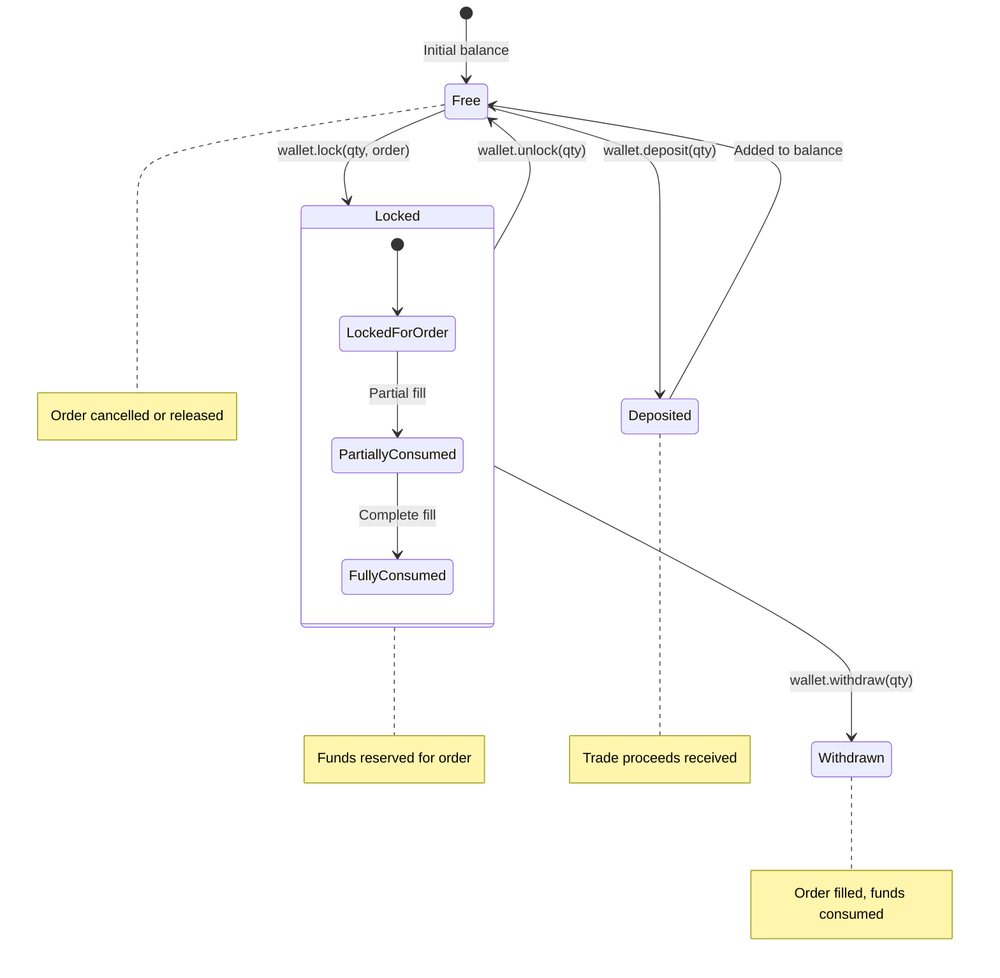
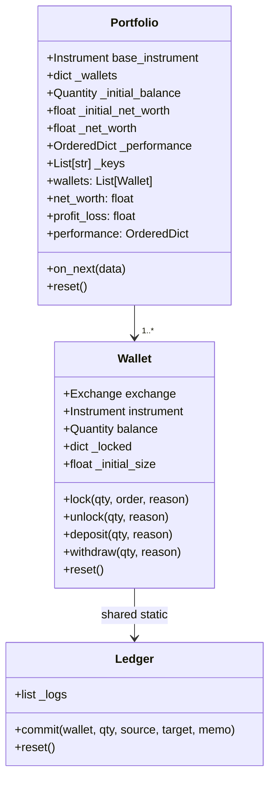
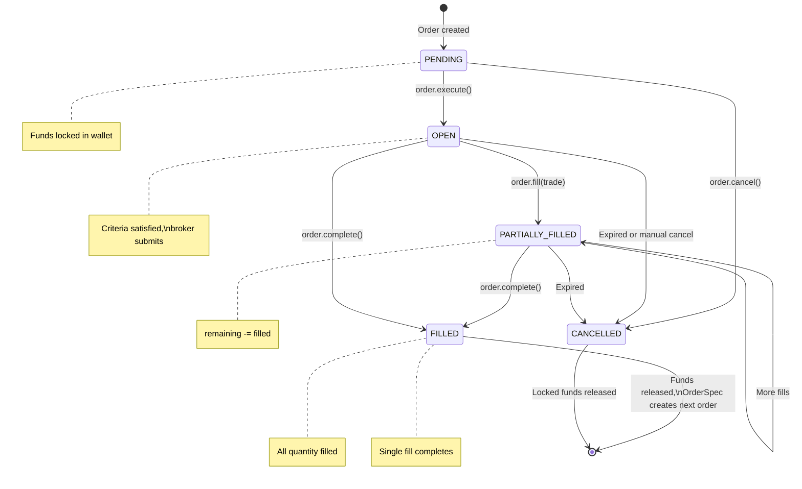
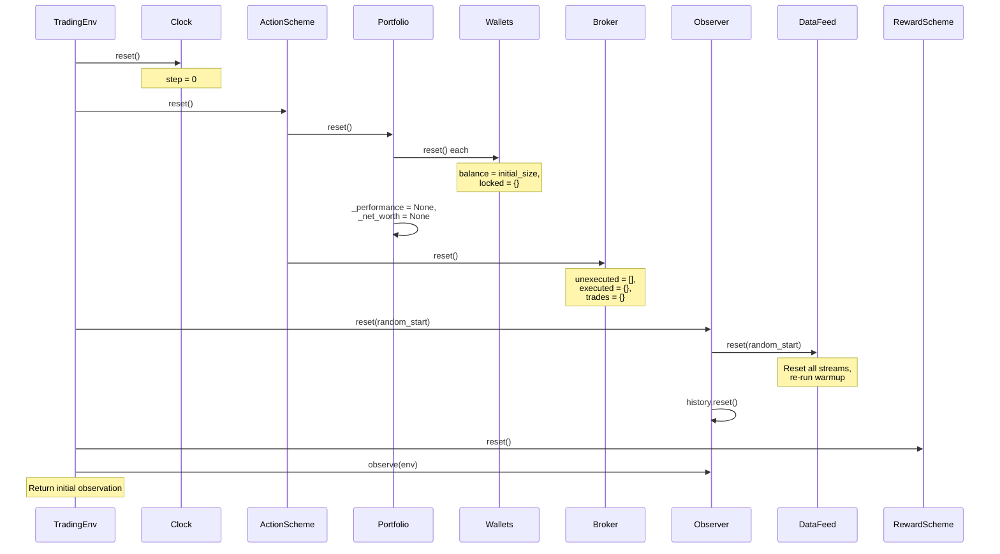

# TensorTrade -- State Management

## Overview

TensorTrade manages state through several interconnected systems: a **Clock** for time synchronization, **Component contexts** for configuration injection, **Wallets and Ledger** for financial state, **Portfolio performance tracking**, and a **reactive feed system** for data state. Unlike centralized store patterns, TensorTrade distributes state across its component hierarchy.

## Clock System



The `TradingEnv` owns a `Clock` instance and propagates it to all components on initialization:

```python
for c in self.components.values():
    c.clock = self.clock
```

The clock advances by one step per `env.step()` call. Components use `self.clock.step` to determine the current time index.

## Financial State

### Wallet State Machine



Each `Wallet` maintains:
- `balance` -- Available (unlocked) funds as a `Quantity`
- `_locked` -- Dictionary mapping `path_id` to locked `Quantity` instances
- `locked_balance` -- Sum of all locked quantities
- `total_balance` -- `balance + locked_balance`

### Fund Locking Protocol

When an `Order` is created, it locks the required funds in the source wallet:

```python
# In Order.__init__()
wallet = portfolio.get_wallet(exchange_id, instrument)
self.quantity = wallet.lock(quantity, self, "LOCK FOR ORDER")
```

This prevents double-spending. Locked funds are tracked by `path_id`, enabling chained orders (entry -> stop-loss -> take-profit) to share the same fund allocation.

### Ledger Audit Trail

Every fund movement is recorded in the `Ledger`:

```python
ledger.commit(
    wallet=self,
    quantity=quantity,
    source="exchange:BTC/free",
    target="exchange:BTC/locked",
    memo="LOCK FOR ORDER"
)
```

The ledger provides a complete audit trail of all financial transactions.

### Portfolio Performance State



The Portfolio subscribes to the observer feed (via `attach()`) and receives `on_next()` callbacks with market data. It extracts net worth from the internal feed streams and maintains a performance history indexed by clock step.

## Order State Machine



### Order Chaining via OrderSpec

Orders can specify follow-up orders using `OrderSpec`:

```python
# Entry order with stop-loss spec
entry_order.add_order_spec(OrderSpec(
    side=TradeSide.SELL,
    trade_type=TradeType.MARKET,
    exchange_pair=ep,
    criteria=stop_loss_criteria
))

# When entry fills, stop-loss order is automatically created
```

## Feed State

### Stream Value Propagation

```mermaid
flowchart TD
    subgraph DAG["Compiled Stream DAG"]
        direction TB
        S1["Source 1<br/>value: 100.5"] --> Op1["pct_change<br/>value: 0.02"]
        S2["Source 2<br/>value: 50000"] --> Op2["log<br/>value: 10.82"]
        Op1 --> G["Group<br/>value: dict"]
        Op2 --> G
        G --> F["DataFeed<br/>value: dict"]
    end

    F -->|next()| Observer
    Observer -->|observe()| ObsHistory["Observation History<br/>(window of dicts)"]
    ObsHistory -->|observe()| NPArray["np.ndarray<br/>(window_size, n_features)"]
```

Each `Stream` holds a `value` attribute that is updated when `run()` is called. The `DataFeed` ensures streams execute in topological order so dependencies are resolved before dependents.

### Stream Types

| Type | Source | Updates |
|------|--------|---------|
| `IterableStream` | Static data (list, array) | Advances iterator each `run()` |
| `Sensor` | Live object observation | Calls `func(obj)` each `run()` |
| `Constant` | Fixed value | Never changes |
| `Placeholder` | Manual push | Updated via `push(value)` |
| `Group` | Multiple streams | Combines into dict |

### Observation History

The `ObservationHistory` class maintains a sliding window of observations:

```python
class ObservationHistory:
    def __init__(self, window_size):
        self.window_size = window_size
        self.rows = OrderedDict()

    def push(self, row: dict):
        self.rows[self.index] = row
        # Evict oldest if exceeding window
        if len(self.rows) > self.window_size:
            del self.rows[oldest_key]

    def observe(self) -> np.array:
        # Pad with zeros if not enough history
        # Convert to numpy array
        return rows_as_array
```

## TradingContext State

The `TradingContext` provides hierarchical configuration state:

```python
config = {
    "shared": {
        "base_instrument": "USD",
    },
    "exchanges": {
        "commission": 0.003,
    },
    "portfolio": {
        "base_instrument": "USD",
    },
    "actions": {
        "trade_sizes": [0.25, 0.5, 0.75, 1.0],
    }
}

with TradingContext(config):
    # Components receive their config section merged with "shared"
    exchange = Exchange(...)  # gets config["exchanges"] + config["shared"]
```

Context is stored on a thread-local stack, supporting nested contexts.

## State Reset Protocol

When `env.reset()` is called, the following cascade occurs:



## State Consistency Guarantees

1. **Fund conservation**: The `Wallet.transfer()` method includes algebraic checks to verify that source deductions equal target additions (accounting for commission).

2. **Order integrity**: Funds are locked at order creation and released only on completion or cancellation. Double-locking and double-unlocking raise exceptions.

3. **Clock monotonicity**: The clock only increments, ensuring a consistent temporal ordering of events.

4. **Feed determinism**: Given the same input data and random seed, the feed produces identical output sequences. The `random_start` parameter in reset provides controlled randomization for training.

---
## See Also
- [README](README.md) — Project overview and quick start
- [Architecture](architecture.md) — System design and components
- [Workflow](workflow.md) — Event flows and processing pipelines
- [Development](development.md) — Development guide and best practices
