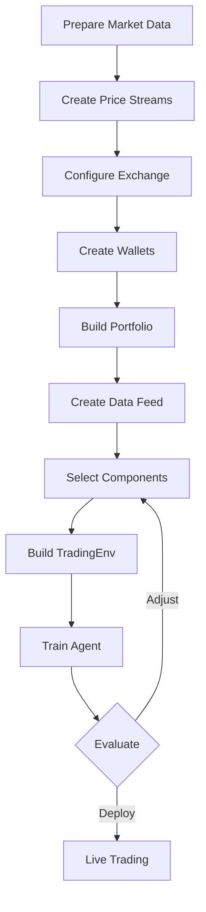
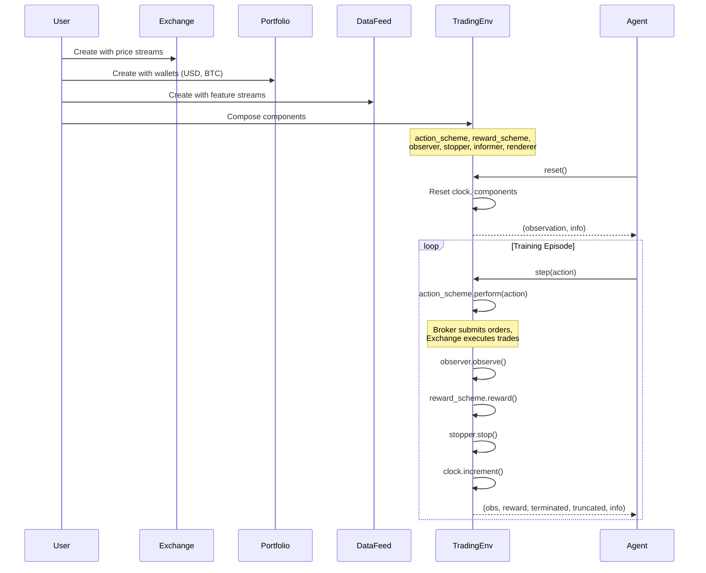
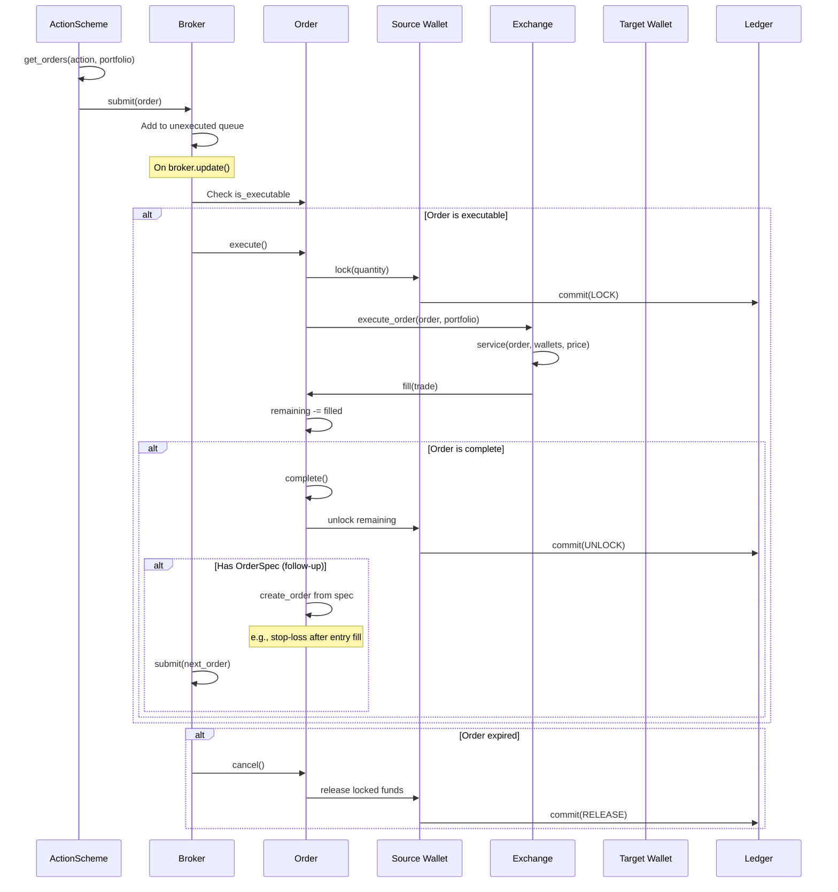
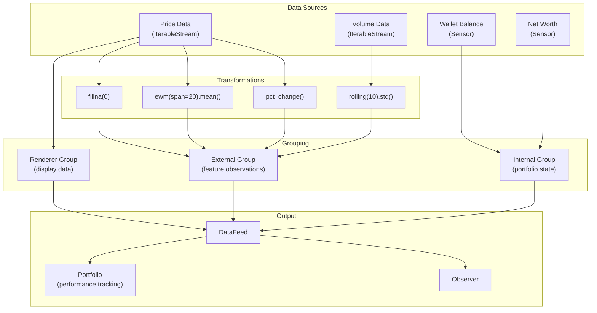
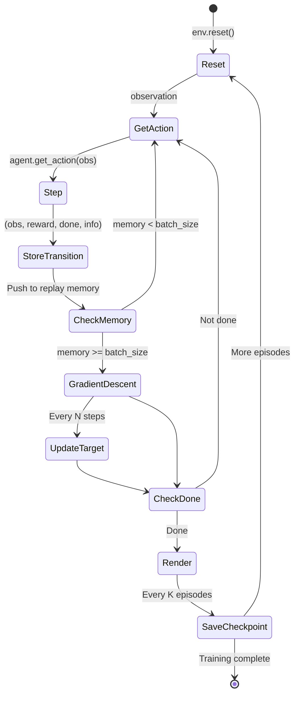
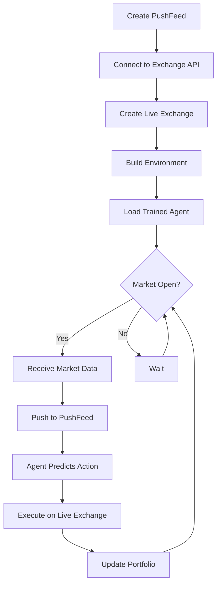
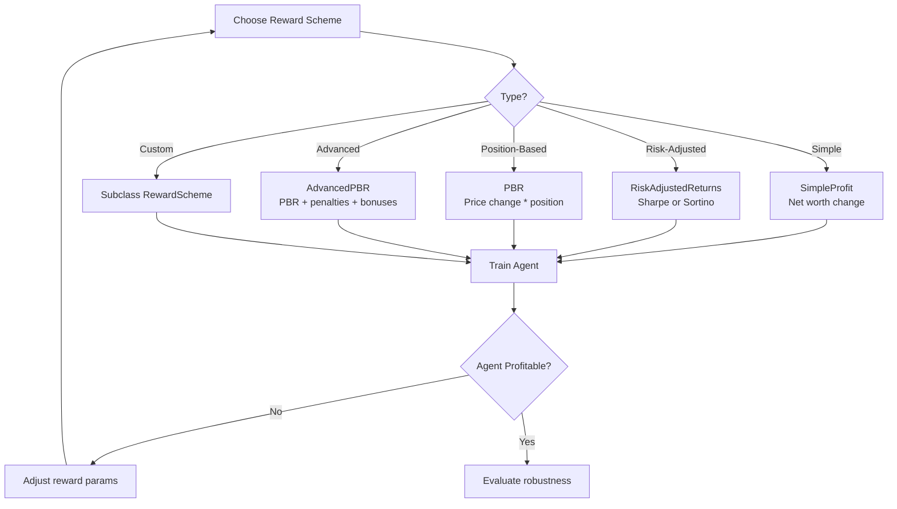

# TensorTrade -- Workflows

## Environment Setup Workflow



## Step-by-Step Environment Construction



## Order Execution Workflow



## Data Feed Pipeline



### Feed Compilation

When `DataFeed.compile()` is called:

1. **Gather**: Traverses the stream DAG to collect all edges
2. **Topological Sort**: Orders streams so dependencies run first
3. **Execute**: On each `next()` call, runs all streams in sorted order
4. **Output**: Returns a dictionary mapping stream names to current values

## Training Workflow

### With External RL Library (Recommended)

```python
# Using Stable Baselines3
from stable_baselines3 import PPO

env = create_trading_env(...)  # TradingEnv instance

model = PPO("MlpPolicy", env, verbose=1)
model.learn(total_timesteps=100_000)

# Evaluate
obs, info = env.reset()
for _ in range(1000):
    action, _ = model.predict(obs)
    obs, reward, terminated, truncated, info = env.step(action)
    if terminated or truncated:
        obs, info = env.reset()
```

### With Built-in DQN Agent (Deprecated)

```python
from tensortrade.agents import DQNAgent

agent = DQNAgent(env)
mean_reward = agent.train(
    n_steps=1000,
    n_episodes=50,
    batch_size=256,
    learning_rate=0.01,
    discount_factor=0.95,
    eps_start=0.9,
    eps_end=0.05,
)
```

### Training Loop Detail



## Live Trading Workflow



For live trading, use `PushFeed` instead of `DataFeed`:

```python
from tensortrade.feed.core import PushFeed, Stream

# Create placeholder streams for live data
price_placeholder = Stream.placeholder(dtype="float").rename("price")
volume_placeholder = Stream.placeholder(dtype="float").rename("volume")

feed = PushFeed([price_placeholder, volume_placeholder])

# On each tick:
data = feed.push({
    "price": current_price,
    "volume": current_volume,
})
```

## Reward Engineering Workflow



## Component Customization

Every component can be replaced by subclassing the abstract base:

```python
from tensortrade.env.generic import RewardScheme

class CustomReward(RewardScheme):
    registered_name = "custom"

    def reward(self, env):
        portfolio = env.action_scheme.portfolio
        # Custom reward logic
        return portfolio.net_worth / portfolio.initial_net_worth - 1.0

    def reset(self):
        pass
```

The `registered_name` attribute enables lookup via the component registry and configuration via `TradingContext`.

---
## See Also
- [README](README.md) — Project overview and quick start
- [Architecture](architecture.md) — System design and components
- [State Management](state-management.md) — State lifecycle and data models
- [Development](development.md) — Development guide and best practices
